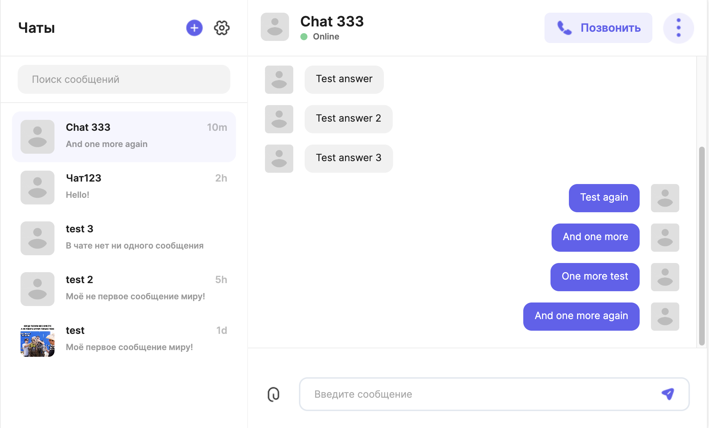

# Мессенджер

Учебный проект курса «Мидл фронтенд-разработчик» от Яндекс Практикума.
Мессенджер реализуется от прототипа на бумаге до развёртывания в сети, используя только JavaScript, Typescript, CSS и API браузера. Никаких библиотек и фреймворков.

Макет в Figma - https://www.figma.com/file/2fwunQb3Khf3hbBlqAZlyp/Messenger

Задеплоенная версия мессенджера - https://deploy--venerable-horse-769dcb.netlify.app/

В проекте реализуются стандартные функции чата:
- регистрация,
- авторизация,
- список чатов,
- обмен сообщениями.

Для проекта Практикум предоставляет REST API + WebSocket API.

## Npm команды

- `npm install` — установка стабильной версии
- `npm run prepare` - установка husky для pre-commit
- `npm run build` — сборка стабильной версии
- `npm run build:dev` — сборка версии для разработки
- `npm run serve` — запуск версии для разработки
- `npm run start` — сборка стабильной версии и запуск на локальном сервере
- `npm run test` — запуск тестов
- `npm run test:coverage` — запуск тестов с отображением покрытия
- `npm run lint` — запуск команд `npm run lint:ts` и `npm run lint:css`
- `npm run lint:ts` — проверка на синтаксические ошибки в TypeScript коде проекта
- `npm run lint:css` — проверка на стилистические ошибки в CSS коде проекта
- `npm run fix` — запуск команд `npm run fix:ts` и `npm run fix:css`
- `npm run fix:ts` — автоматическое исправление синтаксических ошибок в TypeScript коде проекта
- `npm run fix:css` — автоматическое исправление синтаксических ошибок в CSS коде проекта
- `npm run precommit` — запуск команд `npm run lint` и `npm run test`. Используется в прекоммитах для запуска тестов и проверки линтерами

## Технологии, используемые в проекте:

- Языки JavaScript и TypeScript базовые инструменты для реализации приложения. Версия TypeScript ≥ 3.8.
- CSS и PostCSS — инструменты, которые позволяют описать внешний вид.
- WebSocket - протокол связи, используется для обмена сообщениями в режиме реального времени.
- Render — сервис для разворачивания приложения в сети интернет.
- Heroku — сервис для разворачивания динамических приложений в сети интернет.
- NodeJS — инструмент для разработки серверных и сетевых приложений. В проекте используется только в качестве dev-сервера для разработчиков. Версия ≥ 12.
- Parcel, Webpack — инструменты для автоматизации ручной сборки приложения.
- Docker — это платформа для управления эксплуатацией приложения через виртуализацию ОС, на которой оно запускается.
- ESlint, Stylelint, .editorconfig — инструменты для регулирования определённого и единственного стиля кода JS, *CSS-файлов.
- .npmrc, .nvmrc - инструменты для автоматического регулирования определённой версии Node проекта.
- Husky - инструмент для настройкии pre-commit
- Handlebars — инструмент для переиспользования уже готовых компонентов.
- Jest — инструмент для написания тестов.

## Контактная инфомрация

- Telegram: @wrestler7z
- E-mail: kovalev094@gmail.com
